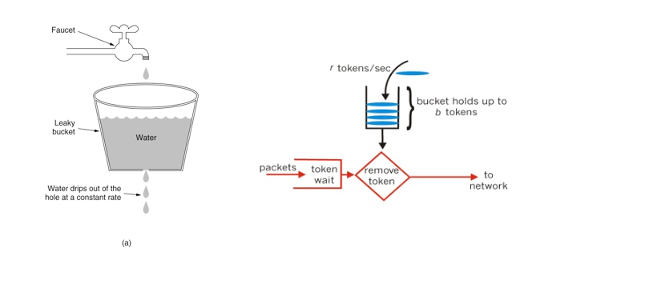
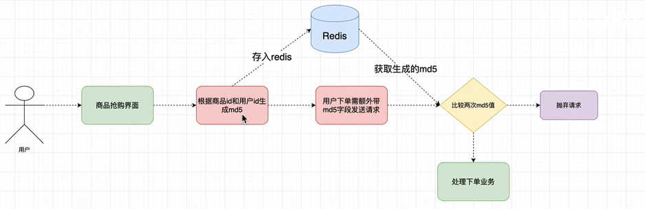

# miaosha

简单的秒杀系统

---

改进：
1. 常规写法（在业务层使用事务）
2. 悲观锁（控制层）
3. 乐观锁（商品的version字段 + 数据库事务特性，业务层）
4. 令牌桶 + 乐观锁（控制层，防止同一时刻大量请求对数据库压力过大）
5. 规定抢购时间
6. 接口隐藏（md5盐值校验）
7. 单个用户访问频率限制

## 悲观锁思路

踩坑：
```java
@Service
@Transactional
public class StockServiceImpl implements StockService {

    public synchronized int kill(Integer id) throws Exception {

        Stock stock = stockDao.findStockById(id);
        if (stock.getTotal().equals(stock.getSale())) {
            throw new Exception("商品已售空！！");
        } else {
            stock.setSale(stock.getSale() + 1);
            stockDao.updateStockSaleById(stock);
            Order order = new Order();
            order.setSid(stock.getId()).setName(stock.getName()).setCreateTime(new Date());
            orderService.insertOrder(order);
            return order.getId();
        }
        
    }
```
注意!!! `错误说法：业务层加同步代码块`

**悲观锁大坑！多提交的问题：
Transactional和synchronized同时使用初始并发问题。
事务同步范围要比线程同步范围大。
synchronized代码块执行是在事务之内执行的，可以推断在代码块执行完时，事务还未提交，因此其它线程进入synchronized代码块后，读取的数据库数据不是最新的。**

解决方法：
synchronized同步范围大于事务同步范围，在 业务层kill方法之外进行同步，保证释放锁的时候事务已经提交
```java
@RestController
@RequestMapping("ms")
public class MiaoshaController {
    
    @GetMapping("kill")
    public String kill(Integer id) {

        try {
            synchronized (this) {   // 控制层的调用处加锁
                int orderId = stockService.kill(id);
                return "秒杀成功！，订单编号 " + orderId;
            }
        } catch (Exception e) {
            e.printStackTrace();
            return e.getMessage();
        }

    }
}
```

可以解决问题（单机下）
缺点：一个线程拿到锁其他线程处于阻塞状态，用户体验差，服务器压力大，吞吐量小


## 乐观锁（利用数据库事务的锁机制）

数据库层面上过滤到一些请求

实际上是把防止超卖问题交给数据库解决，利用 **表中的version字段和数据库的事务** 避免超卖问题

使用表中的version字段：
1. `select id,num,version from stock where id = 1`
2. `update stock set sale=sale+1, version=version+1 where id=1 and version=#{version}`

## 接口限流

`限流：是对某一时间窗口内的请求数进行限制，保持系统的可用性和稳定性，防止因流量暴增而导致的系统运行缓慢和宕机`

在面临高并发的抢购请求时，我们如果不对接口进行限流，可能会对后台系统造成极大的压力。大量的请求抢购成功时需要调用下单的接口，过多的请求打到数据库会对系统的稳定性造成影响.

### 接口限流解决方法

常用的限流算法有 `令牌桶` 和 `漏桶(漏斗算法）`，而 Google 开源项目 Guava 中的 RateLimiter 使用的就是令牌桶控制算法。在开发高并发系统时有三把利器用来保护系统：`缓存`、`降级`和`限流`。

- 缓存：缓存的目的是提升系统访问速度和增大系统处理容量
- 降级：降级是当服务器压力剧增的情况下，根据当前业务情况及流量对一些服务和页面有策略的降级，以此释放服务器资源以保证核心任务的正常运行
- 限流：限流的目的是通过对并发访问/请求进行限速，或者对一个时间窗口内的请求进行限速来保护系统，一旦达到限制速率则可以拒绝服务、排队或等待、降级等处理。

### 漏斗算法和令牌桶算法



- 漏斗算法：漏桶算法思路很简单，水(请求）先进入到漏桶里，漏桶以一定的速度出水，当水流入速度过大会直接溢出，可以看出漏桶算法能强行限制数据的传输速率。
- 令牌桶算法：最初来源于计算机网络。在网络传输数据时，为了防止网络拥塞，需限制流出网络的流量，使流量以比较均匀的速度向外发送。令牌桶算法就实现了这个功能，可控制发送到网络上数据的数目，并允许突发数据的发送。大小固定的令牌桶可自行以恒定的速率源源不断地产生令牌。如果令牌不被消耗，或者被消耗的速度小于产生的速度，令牌就会不断地增多，直到把桶填满。后面再产生的令牌就会从桶中溢出。最后桶中可以保存的最大令牌数永远不会超过桶的大小。这意味，面对瞬时大流量，该算法可以在短时间内请求拿到大量令牌，而且拿令牌的过程并不是消耗很大的事情。

Guava 的 RateLimiter 简单使用
```java
@RestController
public class MiaoshaController {

    // 创建令牌桶实例
    private RateLimiter rateLimiter = RateLimiter.create(50);//每秒产生多少个token

    @GetMapping("limiter")
    public String limiter(Integer id) {
        //1.阻塞式
        //double acqDuration = rateLimiter.acquire();//获取令牌阻塞了多少秒
        //System.out.println(" 等待了 " + acqDuration + " s");

        //2.超时等待
        boolean pass = rateLimiter.tryAcquire(2, TimeUnit.SECONDS);
        if (!pass) {
            System.out.println("当前请求被限流，直接被抛弃...");
            return "请重试.";
        }
        return "令牌桶测试";
    }
}
```

参考：
- https://www.cnblogs.com/xuwc/p/9123078.html
- http://ifeve.com/guava-ratelimiter/


### 乐观锁 + 令牌桶

在乐观锁防止超卖的情况下，使用令牌桶避免同一时刻来自控制层的大量请求对数据库的压力过大

使用令牌桶：
```java
/**
 * 乐观锁 + 令牌桶。使用令牌桶算法，避免同一时刻的请求处理对 mysql 的压力过大
 * @param id
 * @return
 */
@GetMapping("kill2ken")
public String killByToken(Integer id) {

    if (!rateLimiter.tryAcquire(2, TimeUnit.SECONDS)) { // 调用服务层业务之前进行限流
        throw new RuntimeException("抢购过于火爆，请重试~~~");
    }
    
    try {
        int orderId = stockService.kill(id);
        return "秒杀成功！，订单编号 " + orderId;
    } catch (Exception e) {
        e.printStackTrace();
        return e.getMessage();
    }

}
```
效果：由于并发过大，大部分请求在规定时间内没有拿到令牌，没有进入业务层，不会对数据库压力过大


## 访问控制

前边的内容完成了防止超卖商品和抢购接口的限流，已经能够防止大流量把我们的服务器自己搞炸，后边的内容更加关心一些细节问题
1. 我们应该在一定的时间内执行秒杀处理，不能在任何时间都接受秒杀请求，如何加入时间验证？
2. 接口公然暴漏，被别人拿来用脚本抢购怎么办？
3. 秒杀开始之后如何限制单个用户的请求频率，即单位时间内限制访问次数？


### 限时抢购

设置抢购时间，

```java
@Autowired
private StringRedisTemplate stringRedisTemplate;//操作redis

@GetMapping("kill3")
public String killByTokenByExpire(Integer id) {
    
    // 规定缓存中超时记录的键为 <kill + 商品id>
    if (!stringRedisTemplate.hasKey("kill" + id)) {
        //throw new RuntimeException("抢购已结束~~~");
        log.info("抢购已结束!!~");
        return "over";//原理：抢购结束时即 key 超时，redis中商品的 key 会自动销毁
    }

    if (!rateLimiter.tryAcquire(2, TimeUnit.SECONDS)) { // 调用服务层业务之前进行限流
        log.info("抢购过于火爆，请重试~~~");
        //throw new RuntimeException("抢购过于火爆，请重试~~~");
        return "为了控制台更好的显示，这里不抛异常，不打印堆栈";
    }

    try {
        int orderId = stockService.kill(id);
        log.info("秒杀成功！，订单编号 " + orderId);
        return "秒杀成功！，订单编号 " + orderId;
    } catch (Exception e) {
        //e.printStackTrace();
        log.info(e.getMessage());
        return e.getMessage();
    }

}
```

通常情况下，抢购结束后商品不会全部售空。
使用redis服务器提供的超时时间进行访问控制，要求必须在规定时间内才可以进行抢购（即控制层获取令牌）
`set kill1 1 ex 5`


### 接口隐藏

按照视频的说法，感觉有误导性，不是接口被隐藏了看不到了，本质需要添加验证值验证身份？

抢购接口隐藏（加盐）的具体做法：

1. 每次点击秒杀按钮，先从服务器获取一个 ==秒杀验证码==（接口内判断是否到秒杀时间）

2. Redis 以用户ID和商品ID为Key（比如 MS_KEY_1_2 表示商品1，用户2），秒杀地址为 Value 验证值

3. 用户请求秒杀商品的时候，要带上秒杀验证值进行校验

具体流程



1. 用户第一次访问 `/md5` 接口拿到个人的 md5，服务器生成验证值放入 Redis缓存

2. 用户访问下单接口 `/killBymd5` 时需要带上先前拿到的验证值 `md5` 进行校验，服务器进行比对

上图来自视频教程的截图。

具体做法：

1. 使用验证值，即加有随机盐的md5摘要
2. 验证值过期时间，设置验证值过期时间，防止黑客利用 md5 访问真实接口（仍有弊端，需要限制访问频率）

> 补充 MD5：https://www.zhihu.com/question/36445665
>
> MD5：摘要算法（散列算法），明文->密文，只能单向加密不能反向解密，一个明文对应一个密文，可以通过暴力的方法反向比对密文得到明文
>
> 加盐 salt：在原明文的特定位置添加特定的字符串，然后进行 md5 散列。
>
> 好处：加盐后的散列值，可以极大的降低由于用户数据被盗而带来的密码泄漏风险，即使通过彩虹表寻找到了散列后的数值所对应的原始内容，但是由于经过了加盐，插入的字符串扰乱了真正的密码，使得获得真实密码的概率大大降低。

业务层：

```java
@Override
public String getMd5(Integer id, Integer uid) {

    if (id == null || uid == null)
        throw new RuntimeException("商品id或用户id不合法！！");

    // 验证商品id合法性（略）——> 查询数据库
    // 验证用户id合法性（略）——> 查询数据库

    String key = "MS_KEY_" + id + "_" + uid;// MS_KEY_商品id_用户id
    String salt = "!!!Q*?...#";
    String value = stringRedisTemplate.opsForValue().get(key);
    if (value == null) {
        String from = System.currentTimeMillis() + salt;
        value = DigestUtils.md5DigestAsHex(from.getBytes(StandardCharsets.UTF_8));//时间戳 + salt
    }
    stringRedisTemplate.opsForValue().set(key, value, 30, TimeUnit.SECONDS);//刷新验证值超时时间
    log.info("用户验证值获取：用户{}，商品{}, md5{}", uid, id, value);
    return value;
}

/**
 * 用户通过验证值md5秒杀
 */
@Override
public int killByMd5(Integer id, Integer uid, String md5) {

    if (id==null || uid==null || md5==null)
        throw new RuntimeException("参数不合法，请重试~~~");

    String key = "MS_KEY_" + id + "_" + uid;
    String value = stringRedisTemplate.opsForValue().get(key);
    log.info("验证用户：key={}, value={}", key, value);
    if (value == null || !value.equals(md5))
        throw new RuntimeException("请求数据不合法，请重试~~");

    return kill(id);
}
```

控制层：

```java
@GetMapping("getmd5")
public String getMD5(Integer id, Integer uid) {

    try {
        String md5 = stockService.getMd5(id, uid);
        return "获取到验证值为 " + md5;
    } catch (Exception e) {
        //e.printStackTrace();
        return e.getMessage();
    }

}

@GetMapping("killbymd5")
public String killByMd5(Integer id, Integer uid, String md5) {

    // 这里主要为了测试<接口隐藏>功能，不考虑超时抢购
    //if (!stringRedisTemplate.hasKey("kill" + id)) { // 规定缓存中超时记录的键为 <kill + 商品id>
    //    //throw new RuntimeException("抢购已结束~~~");
    //    log.info("抢购已结束!!~");
    //    return "over";
    //}

    if (!rateLimiter.tryAcquire(2, TimeUnit.SECONDS)) { // 调用服务层业务之前进行限流
        log.info("抢购过于火爆，请重试~~~");
        //throw new RuntimeException("抢购过于火爆，请重试~~~");
        return "为了控制台更好的显示，这里不抛异常，不打印堆栈";
    }

    try {
        int orderId = stockService.killByMd5(id, uid, md5);
        log.info("秒杀成功！，订单编号 " + orderId);
        return "秒杀成功！，订单编号 " + orderId;
    } catch (Exception e) {
        //e.printStackTrace();
        log.info(e.getMessage());
        return e.getMessage();
    }

}
```

思考：两步操作怎么耦合？设置超时时间仍不安全，需要规定单个用户的访问频率，在缓存中记录用户在最近 5s 内的访问次数，设计一个访问上限

### 设置访问频率


